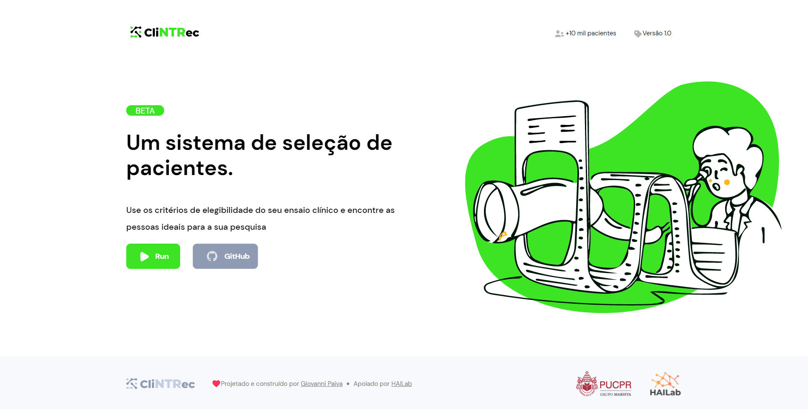
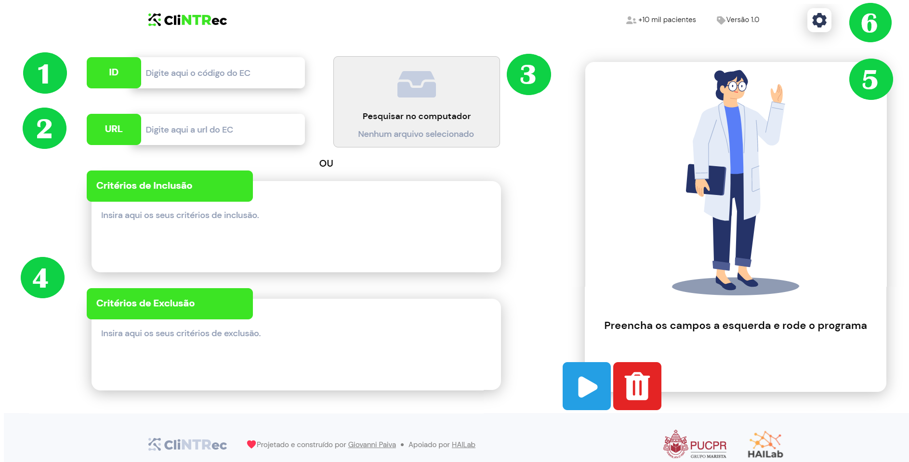
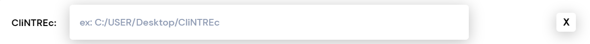

# CliNTREc - Interface  

The oficial interface for CliNTREc, created with [Electron](https://www.electronjs.org/), HTML, CSS and  Javascript.

## Installation

Download both [CliNTREc](https://github.com/paivagio/CliNTREc) and its Interface (see bellow) and proceed to link them by refering to the instructions that follow.

| Name | Version | Date | Link |
|------|------|------|------|
| CliNTREc Interface | 1.0 | 21/07/2021 |[Download](https://github.com/paivagio/CliNTREc-Interface/archive/refs/heads/main.zip)|

## Usage

Launch the application by running the **CliNTREc.exe** file, located at the **Interface/** 
folder, and proceed by clicking the **RUN** button.

### Input

The available input fields are:
1. ID
2. URL
3. Text file
4. Manually

Please check [CliNTREc's usage guide](https://github.com/paivagio/CliNTREc/#usage) for input format detailing.

### Running

Once you are done filling up your criteria, proceed to the **Run (5)** frame where you will find two buttons:

- RUN: Sends your input to the program and selects pacients.
- TRASH: Resets all fields

### Settings

You will need to indicate where CliNTREc is located by going to **Settings (6)**, the interface will warn you incase you leave it blank and you will also need to fill it up every time you open the app. 

### Output

After you have run the program you will come across the **Results** frame, which will replace the **Run** frame. In this new frame it is possible to see the amount of selected pacientes as well as downloading the processed eligibility criteria and the relation of selected pacients.

## Acknowledgement

Special thanks to all the amazing people from [HAILab](https://github.com/HAILab-PUCPR) who helped me throughout this project and also to [Fundação Araucária](http://www.fappr.pr.gov.br/) for the research grant.

